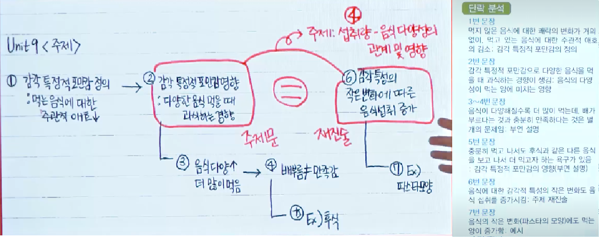

## 영어
### 개괄 (1강)
- 누구를 위한 강의, 무엇을 얻을 수 있는지
- 누구를 위한 강의?
  - 제대로 알고 하고싶은 사람
- 너무 많아서 뭐가 옳은지 모름, 떨어지지 않음

- 답을 주는 방법
  - 수십가지에 대한 답을 주되, 몇개의 문장으로 전달

### 영어의 CODE
- 우습게 보면 안된다.
- 수능보다 내신이 더 어려움

### Code #0 입시 영어는 [문장 해석력 + 지문 독해력]이 핵심이다. (2강)
  - 입시 영어는 문장 해석을해석 잘해야 한다.
    - 지문, 문장 > 단어
    - 의식하고 공부해야 함
  - 지문 독해 : 해석은 잘 한것 같은데도 항상 틀린다?
    - 한글로 되어도 이해하지 못하는 경우(내용을 이해하지 못하는 경우)
    - +@의 암기가 필요하지만, 미뤄두고 해나중에 몰아서 해도 됨
  - 암기한 내용을 늘리는 것이 아니라 능력을 길러야 함
  - 내신은?
    - 지문은 그대로 내고, 문제는 새롭게 냄
    - 요약해서 내는 경우
    > 그 전까지 열심히 문장 해석력 + 지문 독해력을 기르고, 시험이 가까워지면 추가로 암기

### Code #1 문장 해석력은 [문장 성분]이 핵심이다. (3강)
  - 문장 성분?
    - 주어, 서술어, 목적어, 수식어
    - 조사를 통해서 의미를 파악

### Code #2 지문 독해력은 [문장 연결]이 핵심이다. (4강)
  - 지문 독해력이 부족한 경우 (한글로 되어있어도 이해를 못하는 지문) - 세미 비문학
   - 비문학은 너무 복잡한 구조로 되어있기 때문에 문장 구조도를 작성하는 것이 적절하지 않음 (실제 비문학 수준의 복잡도는 아님, 비문학과 조금 별개로 생각할 필요가 있음)
  - 예)
    - 영어를 잘하는 학생이 주제를 파악하는 습관을 가지고 있음, 답지에도 주제가 있는 것을 선택
    - 문장 구조도 작성
    
  - 실제 답과 연결된 부분만 읽는 것은 옳은 방향이 아님 x (이런 강사의 강의는 듣지 말것)
  - 훈련 + 탐구를 반복하는 것이 필요

### Code #3 영어 듣기는 [발음 현상 + 해석 속도]가 추가된다. (5강)
  - 듣기 문제는 #1, #2를 귀로 하는 것
  - 주요
    - 발음 현상
      - 발음 현상에 대한 훈련이 되어있지 않으면, 들은 것들이 어떤 단어인지 연결하는 것이 어려움
      - ex) first aid to ... (펄스데잇투)
      - 틀렸을 경우, 발음 현상 확인 필요 (들은 것과 실제 단어의 연결 확인)
        - 너무 기반이 없는 경우 관련 인강을 보는 것도 도움이 됨
    - 해석 속도
      - 훈련이 되지 않는 경우, 앞문장을 듣고 이해하다가 이후의 문장을 듣지 못함
  - 컨설팅 : 지문 문제부터 연습 > 발음 현상(받아쓰기) > 속도 훈련(배속기능 활용)
그럼 이걸 어떻게 공부해야하 하나? 의식은 어떻게 하는가?

### 요약 (6강)
  - 문장 성분, 문장 연결이 핵심, 그 외는 +@
  - 평소(예습/수업/복습) > 내신 > 방학(선행) > 수능/논술
    > 테마를 가지고 공부/훈련
