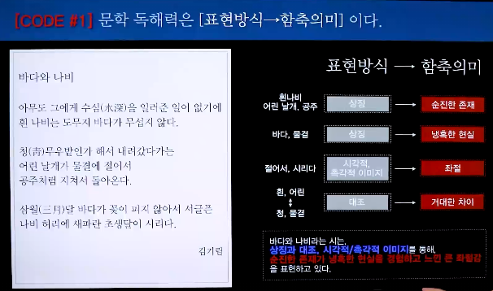
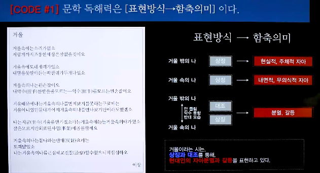
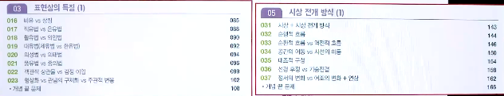
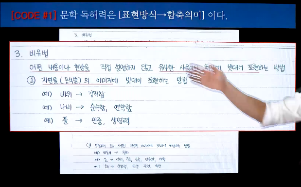
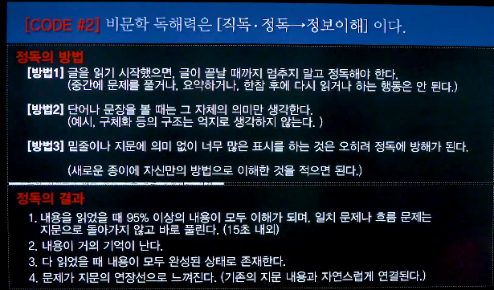

## 국어
### 개괄 (1강)
  - 다 똑같은듯
  1. 입시 국어는 [독해력]이 핵심이다.
  2. 문학 독해력은 [표현방식->함축의미]이다.
  3. 비문학 독해력은 [직독&정독->정보이해]이다.

### 1. 입시 국어는 [독해력]이 핵심이다.
  - 읽기(70%) + @
    - + @도 결국 읽기를 기반으로 함
    - 결국 읽기 100%라고 이해하면 됨
  - 수능 문제
    - 지문을 잘 읽었는지 확인하는 문제
    - 화법, 작문, 문법은??은 독해력이 아니지 않나? But 지문을 읽어야 함 (독해력을 기반으로 함)
  -  독해와 독해력은 다르다
    - 지문이 달라질 수 있고(외부 지문) 이미 나온 부분에 대해서도 외울 수 없음, 이럴때는 '력'이 필요
  - 그럼 독해력을 어떻게 키우나? > 다음 코드에 나옴

### 2. 문학 독해력은 [표현방식->함축의미]이다.
  - 함축 의미란?
    - 글쓴이가 숨겨둔 의미 (문학은 직접적으로 표현하지 않음)
      - 사례)
      
      
    > 시, 표현 방식, 함축 의미 이렇게 세트로 이해해야함
  - 적용 방법1 (혼자 공부)
    - 초급자 : 바탕이 없음 > 표현방식 공부 (시인&작가들이 사용하는 모든 기법)
      
    - 중급자 : 지문 훈련(지문 훈련하다가 잘 모르겠으면 초급자 공부부터) > 위의 사례 참고
    - 인강 보는 방법?
      - 초급자 : 그냥 훑어보기 (표현방식 주입)
      - 중급자 : 스스로 훈련하고, 훈련한 내용을 강사의 풀이와 대조
    - 보완 노트
      
  > 표현 방식 : 머리에 저장(외우기)
  > 함축 의미 : 훈련
  - 적용 방법2 (학교 공부)
    - 중요한 부분과 중요하지 않은 부분을 구분해서 받아들이는 기술이 필요(이거는 모든 과목에서 중요) : 지칠 수 있기 때문
  - 학교 선생님이 강조하고자 하는 것을 파악하는 것이 중요
    - 목소리의 높낮이 등의 표현에 신경을 쓰는 것이 중요
  - 중요한 부분과 중요하지 않은 부분을 스스로 파악하려고 노력하는 것이 중요
  > 범위 공부와 훈련을 같이하는 것이 중요

### 3. 비문학 독해력은 [직독&정독->정보이해]이다.
  - 비문학은 대부분이 어려워하는 장르
  1. 비문학은 그냥 읽어서 정보를 파악해야 한다.(문학과 다름)
  2. 독해력
      - 순수 독해력 (비문학)
        - 그냥 읽기
        - 직독&정독
        - 추상
        - 복합
        - 능력
        - 훈련
        > 훈련 : 내가 한다 + 시간이 필요하다
      - 지식 독해력 (문학)
        - 지식에 기대어 읽기
        - 표현방식
        - 구체
        - 단순
        - 지식
        - 강의
  3. 비문학은 그냥 읽어야 하지만 내용이 어려움
      - 추상, 복합, 능력, 훈련
      - 동시에 복잡한 모든 것이 필요
      > 문학의 경우에는 함축 의미를 이해하기 위한 배경지식이 필요한 부분이지만, 비문학은 그 내용 그대로 파악하는 것이 필요하므로 전혀 별개로 생각하고 훈련하는 것이 필요 (이 부분이 이해가지 않으면 삼촌한테 다시 물어볼 것)

  
  - 완벽하게 이해했는지 확인하는 방법 : 친구에게 설명하기
  - 이해하지 못하는 경우를 상세하게 분석 필요 (문제 푸는중에 하는 것이 아님)
    - 사례
      - 어휘 이해 못함
      - 주제 문장과 근거 문장을 모호하게 구분
      - 내가 아는 배경 지식을 끼워맞추다가 그대로 독해하지 못함

  - 훈련 방법
    - 따로 필기 없이, 완벽 이해(글 그대로, 배경지식 배제)

### 결산
  - 비문학 : 표현방식 : 하, 직독&정독 : 상
  - 시 : 표현방식 상, 직독&정독 : 하
  - 수필, 소설/극
  > 극단적인 비문학이나 시를 통해 문학/비문학의 극한부분을 메인으로 공부하고, 그 외에 수필, 소설/극은 추가적으로 공부
