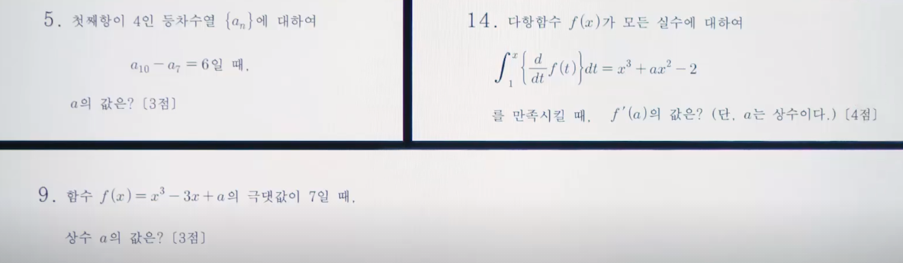
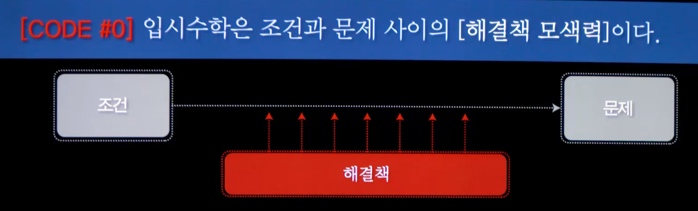
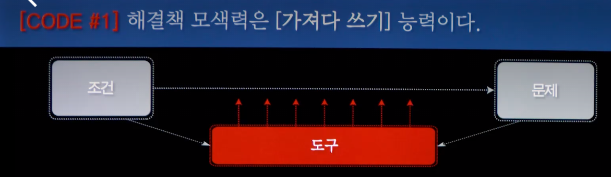
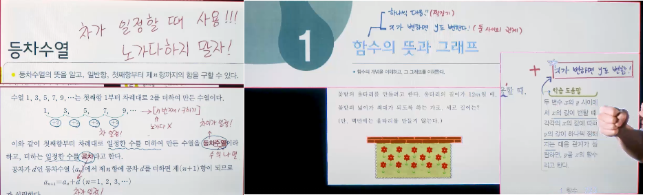
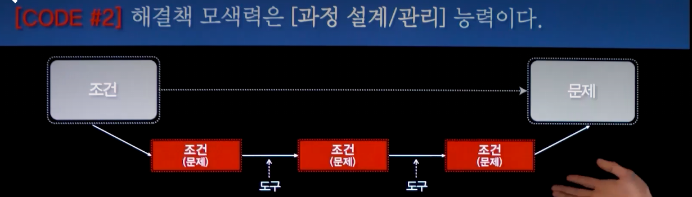
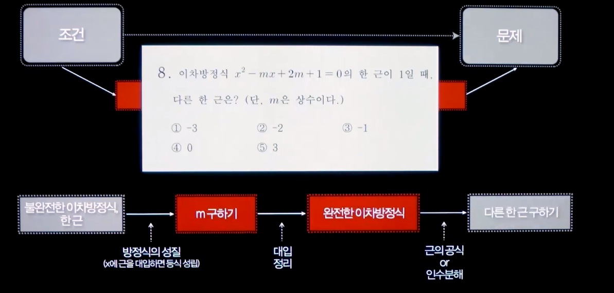
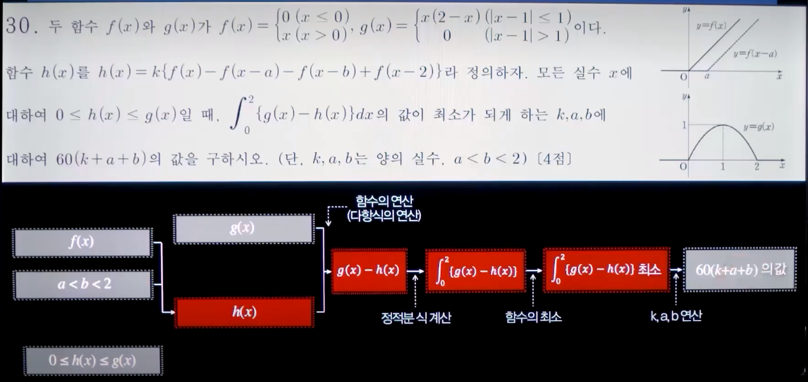
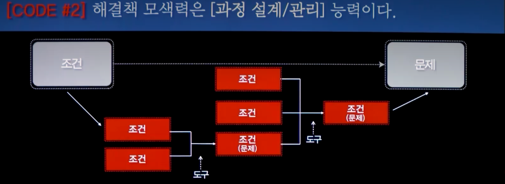

## 수학
### 개괄
   - [CODE #0] 입시수학은 조건과 문제 사이의 [해결책 모색력]이다.
   - [CODE #1] 해결책 모색력은 [가져다 쓰기] 능력이다.
   - [CODE #2] 해결책 모색력은 [과정 설계/관리] 능력이다.
   > 제목만 봐서는 이해하기 어려울 수 있음

### [CODE #0] 입시수학은 조건과 문제 사이의 [해결책 모색력]이다.
   - 입시 수학은? 시험을 잘보기 위해 하는 수학
   - 조건과 문제 사이? 수학을 단순화 시키면 "조건 > 문제"
   
      - "~할 때" : 조건
      - "????는? : 문제

> - 다른 과목과 별개로 공부해야 함
> - 다른 과목 : 외우는 것, 내 지식과 매칭시키기
> - 문제가 시험 범위 외에서 출제 됨(변형 1위 과목)
> - 수학은 스스로 고민해서 해결책을 내서 풀어야 하는 과목

### [CODE #1] 해결책 모색력은 [가져다 쓰기] 능력이다.
   - 
   > 도구가 있는 곳 ? 교과서!
   > 어차피 교과서에 있는 도구를 활용하면 풀 수 있으므로, 쫄필요가 없음
   > 공식 이름을 바꾸어서 이해하자 : "어떤 조건"에서 "무엇을 구하라"고 할때 사용하는 법칙
   >> 조건 + 문제를 파악하여 공식 매칭

   - 핵심
     - 문제 파악 : 조건/문제로 구분
       > 문제를 조건/문제로 분리하여 이해하는 훈련 필요
     - 공식 유추 : 파악한 조건 + 문제를 가지고 사용할 도구(공식) 유추
       > 공식 유추는 공식 이해를 조건+문제로 (외우기/이해하기) ..
    > 문제를 정확하게 이해하는게 먼저(조건/문제), 정확한 방법(공식)을 사용해서 푸는게 두번째.

  - 개념 이해 : 어디에 사용되는 것인지를 파악
   - 

### [CODE #2] 해결책 모색력은 [과정 설계/관리] 능력이다.
   - 
   - 
   - 
   > 문제부터 시작해서 역순으로 조건을 만들어 가는 연습 필요 (도출 방향 : 오른쪽 > 왼쪽)
   >> 풀이할때 사용하는 도구는 가설로 세워야 함 ("이거를 사용하면 되겠다." 라고 대략적으로 도구를 선택. 선택한 도구가 옳지 않을 수 있다는 것을 감안해야 함.)
   - 
