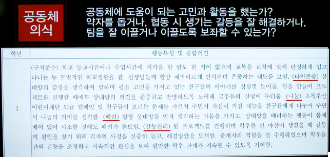
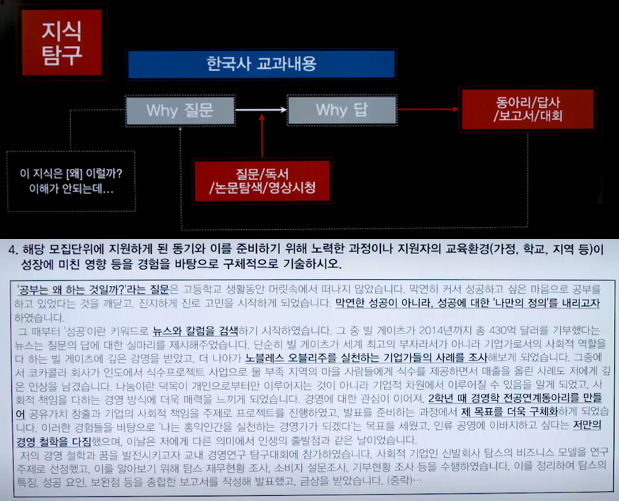

## 학종
### 개괄
   - 코드
      1. 동아리
      2. 대회
      3. 독서
      4. 봉사
      5. 수업
      6. 교과
      7. 생기부
      8. 자소서
      9. 면접
   1. [CODE #0] 학종은 [능력 = 활동 + 점수]를 평가한다.
   2. [CODE #1] 학종의 능력은 [지식탐구/진로준비/공동체의식/문제극복]이다.
   3. [CODE #2] 학종의 활동은 [Why를 위한/에 의한]활동이다.

### [CODE #0] 학종은 [능력 = 활동 + 점수]를 평가한다.
   
   - 대학이 점수만으로 보여줄 수 없는 것을 보기 위함
   - 오해
      - 능력 없어도 착하고 성실하면 된다.
      - 공부 못해도 활동만 잘하면 좋은 대학 갈 수 있다. (공부도 잘해야 한다)
      - 예나 지금이나 결국 공부만 잘하면 된다.
      > 공부도 잘해야 한다.
      - 비교과는 활동 양이 많은 것이 중요하다.
      > 능력을 보여주기 위한 활동이여야 함
      - 어쩄든 점수는 잘만 나오면 된다.
      > 점수만 좋아서는 안된다. 활동도 중요
   > 과정 중심의 평가

### [CODE #1] 학종의 능력은 [지식탐구/진로준비/공동체의식/문제극복]이다.
   
   - 학업역량-지식탐구 : 이해가 안되거나 궁금증이 생긴 과목 지식에 대하여, 깊이 파고들어 결국 이해해내는 능력이 있는가?
   
   - 전공적합성-진로준비 : 꿈과 전공을 찾으려고 노력했는가? 찾았다면 그 분야에 대해 조사하고 준비했는가?
     > 방향을 정하는 여정 + 방향을 정한 이후의 활동
   
   - 인성-공동체의식 : 공동체에 도움이 되는 고민과 활동을 했는가? 약자를 돕거나, 협동 시 생기는 갈등을 잘 해결하거나, 팀을 잘 이끌거나 이끌도록 보좌할 수 있는가?
   
   - 발전가능성-문제극복 : 어떠한 어려운 상황이 닥쳐도 체념하지 않고, 문제를 극복해 나갔는가?
   

### [CODE #2] 학종의 활동은 [Why를 위한/에 의한]활동이다.
   - 어떻게 활동해야 하는가? > 제대로 내 능력을 보여주는 방향
   
   - 자기소개서? : 배우고 느낀점?
   
   
   
   
